# SmartCRMShield

SmartCRMShield is a robust and scalable CRM (Customer Relationship Management) application designed to streamline customer interactions, enhance productivity, and provide actionable insights. This project leverages modern .NET technologies to deliver a secure and efficient solution for managing customer relationships.

## Features

- **Localization Support**: Includes multi-language support using the Humanizer library.
- **Identity Management**: Built-in authentication and authorization using ASP.NET Core Identity.
- **Entity Framework Core**: Database management with support for SQLite.
- **Responsive UI**: Frontend styled with Bootstrap for a mobile-friendly experience.
- **Static Web Assets**: Efficient handling of static files like CSS, JavaScript, and images.

## Prerequisites

- [.NET SDK 8.0](https://dotnet.microsoft.com/download/dotnet/8.0)
- [Node.js](https://nodejs.org/) (for managing frontend dependencies, if applicable)
- SQLite (for local database)

## Getting Started

1. **Clone the Repository**:
   ```bash
   git clone https://github.com/your-repo/SmartCRMShield.git
   cd SmartCRMShield
   ```

2. **Restore Dependencies**:
   ```bash
   dotnet restore
   ```

3. **Build the Project**:
   ```bash
   dotnet build
   ```

4. **Run the Application**:
   ```bash
   dotnet run
   ```

5. **Access the Application**:
   Open your browser and navigate to `https://localhost:5001`.

## Project Structure

- **`/wwwroot`**: Contains static assets like CSS, JavaScript, and images.
- **`/obj`**: Auto-generated files for build and runtime.
- **`/bin`**: Compiled binaries and runtime files.
- **`/SmartCRMShield`**: Core application logic and configuration files.

## Key Dependencies

- **Humanizer**: For localization and human-readable text transformations.
- **Entity Framework Core**: For database operations.
- **ASP.NET Core Identity**: For user authentication and authorization.
- **Bootstrap**: For responsive UI design.

## 📸 Screenshots

### 🏠 Home Page
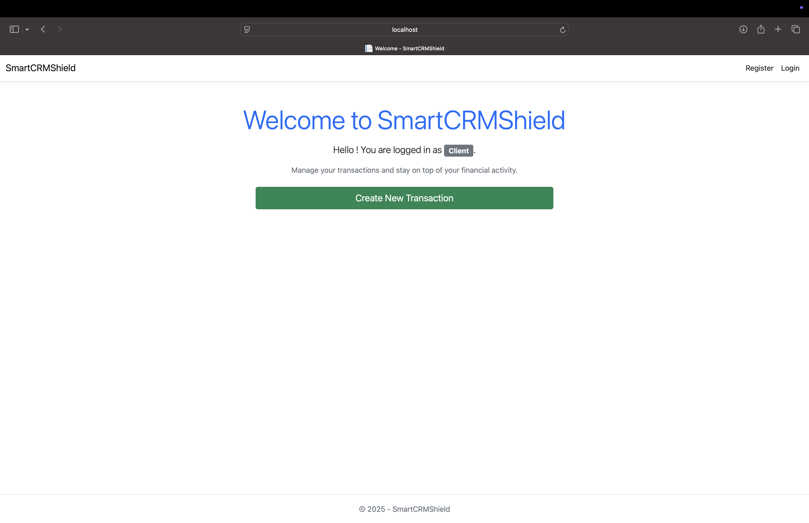

### 📝 Register
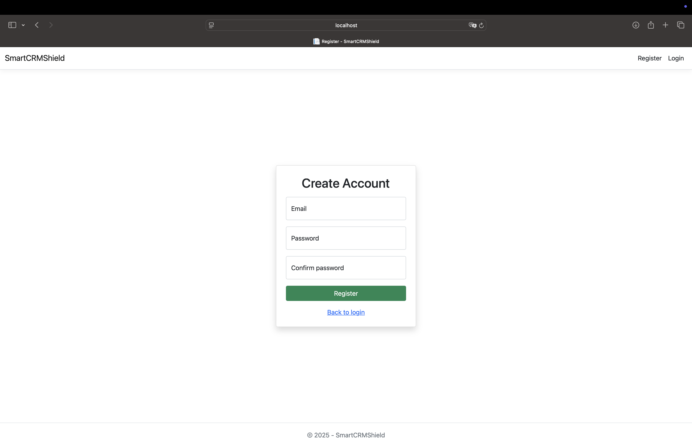

### 🔐 Login
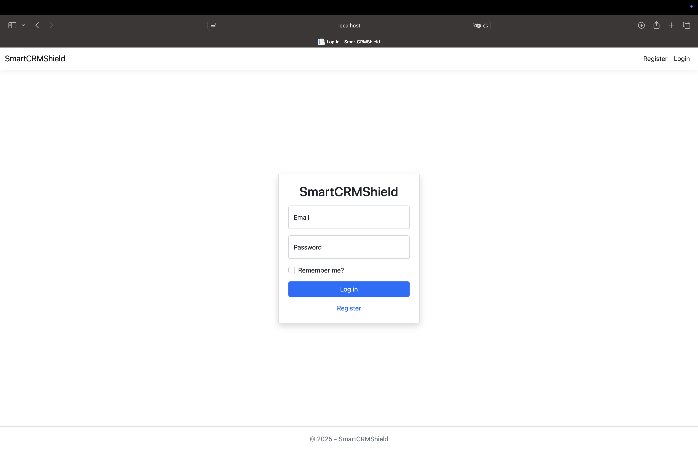

### 🧑‍💼 Admin Dashboard
Landing view for admin users.
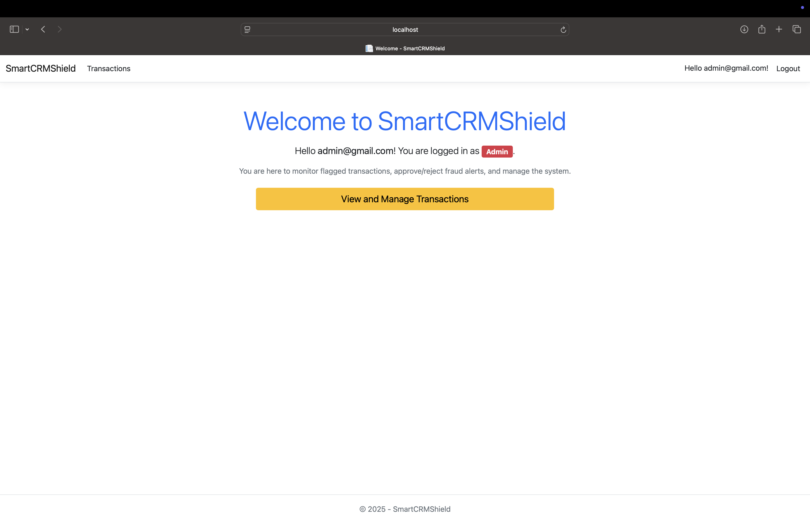

### 📋 Admin Transactions View
Admin sees all transactions (flagged or not).
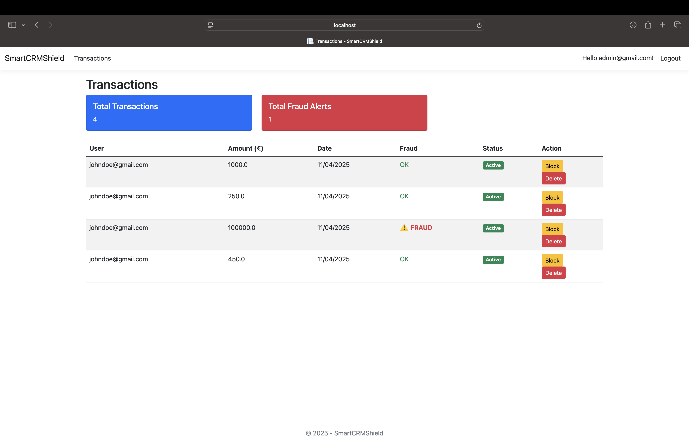

### 🚫 Block & Delete Fraudulent Transactions
Admins can block or delete transactions as needed.
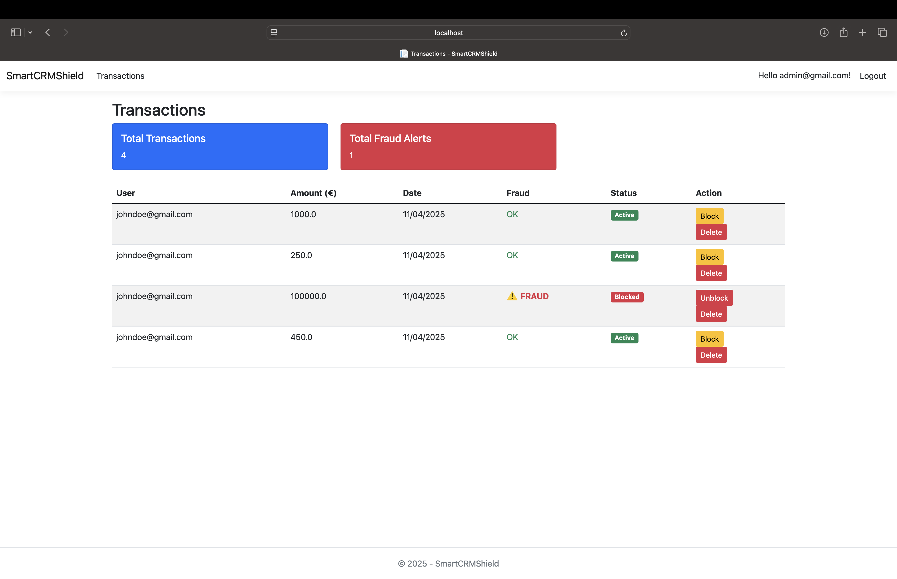
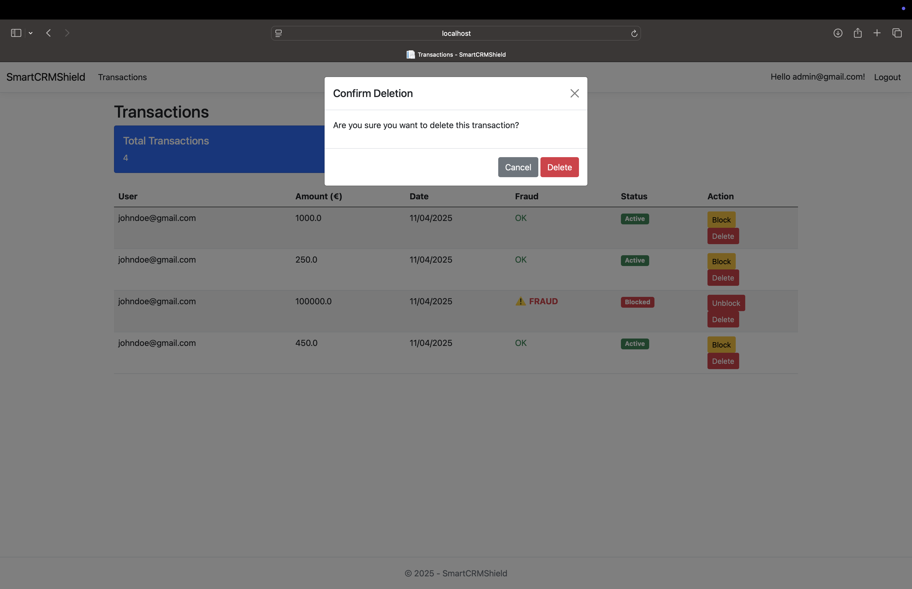

### 👤 Client Dashboard
Client landing page after login.
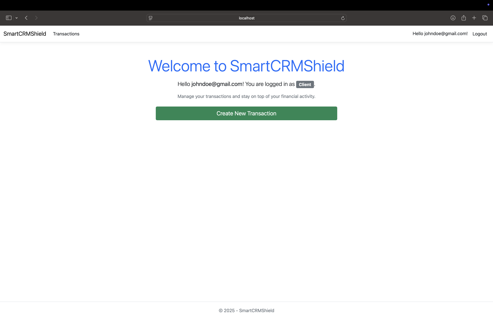

### ➕ Client View & Create Transactions
Clients can view or create new transactions.
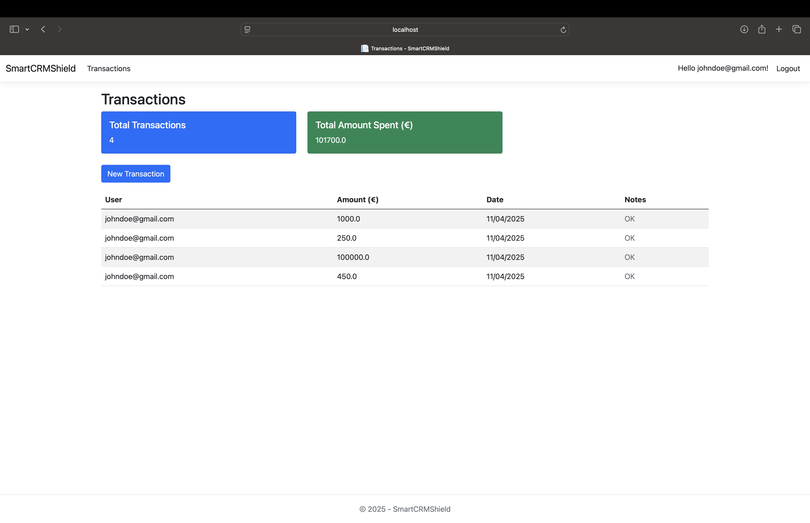
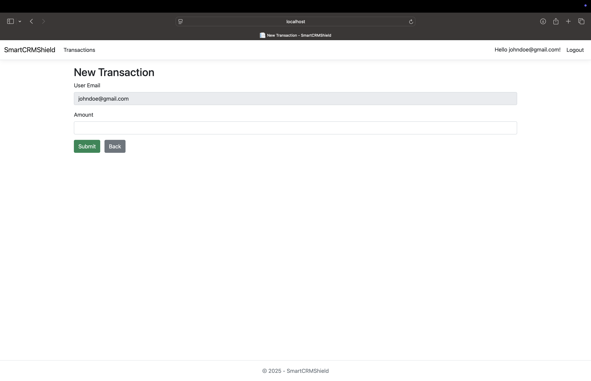

### 🔒 Blocked Transaction View
Clients see blocked status where applicable.
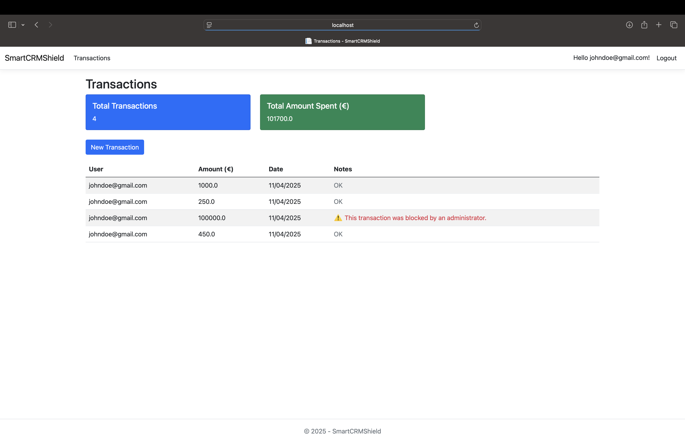

## Contributing

Contributions are welcome! Please follow these steps:

1. Fork the repository.
2. Create a new branch for your feature or bugfix.
3. Commit your changes and push the branch.
4. Open a pull request.


## Contact

For questions or support, please contact [george.michael724@gmail.com].
